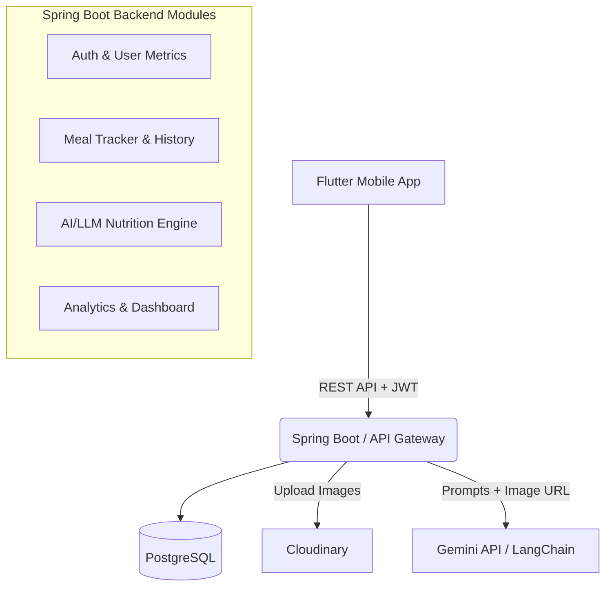

# Kiến trúc Hệ thống Nutrition Management

Dự án này là một ứng dụng quản lý dinh dưỡng toàn diện, cho phép người dùng theo dõi calo, nhận diện món ăn bằng ảnh qua AI (Gemini), và tự động tạo thực đơn dựa trên chỉ số cơ thể.

## Tóm tắt giải pháp

- **Đối tượng sử dụng**: Cá nhân muốn kiểm soát tổng thể cân nặng, sức khoẻ (tăng cân / giảm cân / giữ cân).
- **Giá trị cốt lõi**: Khác với các app truyền thống nhập liệu thực phẩm mệt mỏi, hệ thống này sử dụng AI / Vision (Gemini) để ước tính calo từ ảnh món ăn, giúp giảm ma sát rất lớn trong việc theo dõi hàng ngày. Ngoài ra, LLM trở thành một chuyên gia dinh dưỡng ảo cá nhân hoá (tự động lên thực đơn, tự động đổi món tương đồng calo).

## User Review Required
> [!IMPORTANT]
> - Về việc quản lý hình ảnh: Ảnh thao tác từ ứng dụng Mobile sẽ được gởi qua Backend Spring Boot -> Backend xử lý đẩy lên Cloudinary -> Trả URL cho Gemini AI để phân tích. Cách này làm API của chúng ta dễ kiểm soát hơn, bảo mật API Key của Cloudinary và Gemini ở phía Backend thay vì để ở Frontend.
> - Kế hoạch này áp dụng Flutter Framework cho Frontend và Java Spring Boot (100% REST APIs) cho Backend.
> 
> Bạn có đồng ý với định hướng kiến trúc này trước khi tiến hành viết code cho một trong hai (hoặc cả hai) phía không?

## Kiến trúc Tổng thể (Production-Ready)

Ứng dụng sẽ quản lý theo mô hình **Client-Server Architecture**:



## Cấu trúc Thư mục (Folder Structure)

### 1. Backend (Spring Boot) - Áp dụng Layered / Clean Architecture
Phù hợp nhất với môi trường Spring MVC và đồ án chất lượng cao. Đảm bảo Single Responsibility.

```text
src/main/java/com/nutrition/app
├── config/           # Cấu hình Spring Security, Swagger, RestTemplate, Cloudinary, Gemini
├── controller/       # Tầng giao tiếp mạng, định nghĩa các thiết kế REST APIs
├── dto/              # Request / Response Payload Models
├── exception/        # Global Exception Handler (`@ControllerAdvice`)
├── model/            # Cấu trúc Entities đại diện Database Tables (JPA/Hibernate)
├── repository/       # Tầng Data Access bằng Spring Data JPA
├── security/         # Authentication filter (JWT), UserDetailsService
├── service/          # Các Interface định nghĩa Business Logic
└── service/impl/     # Cài đặt chi tiết (Implementation) của các Logic
```

### 2. Frontend (Flutter) - Áp dụng Feature-First Architecture
Giúp dễ mở rộng các tính năng, gom block liên quan vào một folder độc lập.

```text
lib/
├── core/             # Code dùng chung (theme, http_client, constants, utils, errors)
├── data/             # API Data sources & Các Repositories
├── domain/           # Models (Data Transfer Objects trong client)
├── features/         # Features độc lập:
│   ├── auth/         # Đăng nhập, Đăng ký
│   ├── onboarding/   # Flow thu thập chỉ số cá nhân (nhập chiều cao, cân nặng, mục tiêu)
│   ├── dashboard/    # Màn Home với Report tổng quan calo hôm nay
│   ├── logger/       # Flow nhận diện món ăn (Camera, Image Picker) + Update kết quả 
│   ├── planner/      # Meal plan gợi ý hàng tuần / Swap meal
│   └── profile/      # Biểu đồ cân nặng và Settings
└── shared/           # Design System (các Widgets được thiết kế riêng: Buttons, AppBars...)
```

## Các Module Backend Chính
1. **Auth & Identity Module**: Xử lý tạo tải khoản, Security JWT.
2. **User Profile & Metrics Module**: Lưu trữ thông tin cá nhân hiện đại. Chịu trách nhiệm thực hiện phép tính chuẩn hoá về BMI, BMR, TDEE, và xác định mục tiêu Calo/Macros để làm baseline cho các hệ thống khác gợi ý.
3. **Meal Tracker Module**: Quản lý lịch sử ăn uống, thực hiện các thao tác CRUD lên Meal entity. Tương tác với Cloudinary Upload Service.
4. **AI/LLM Service Module (Tâm điểm)**:
   - *Vision Analyzer*: Giao tiếp bằng Gemini Vision, dùng Prompt Engineer để AI trả về một JSON quy chuẩn `{"item_name": "...", "calories": 400, "macros": { "protein": 10, "carbs": 30, "fat": 5 }}`.
   - *Nutrition Planner System*: Từ dữ liệu TDEE ở Module 2, tạo Prompt để ra các list thức ăn gợi ý theo các chế độ chuẩn kết hợp cùng khẩu vị người dùng.
5. **Analytics Module**: Dịch vụ tính toán tổng hợp trả về dữ liệu cho Dashboard.

## Các Màn hình Frontend (Screen Flows)
1. **Onboarding / Splash**: Chào mừng, slide thông tin. Giao diện dạng step-by-step để thu thập (Chiều cao, độ tuổi, sinh trắc học, mục tiêu tăng/giảm cân).
2. **Auth Gateway**: Đăng nhập, Đăng ký.
3. **Home Dashboard**: 
   - Summary Card (Calo đã Nạp / Mục tiêu / Tổng ngân sách ngày).
   - Danh sách bữa ăn hôm nay (Sáng/Trưa/Chiều/Snack).
   - Action Button nổi (FAB) bự ở giữa để luôn sẵn sàng "Scan" món ăn.
4. **Scan/Log Meal (Camera View)**: Màn hình chụp/tải ảnh -> Processing Animation sinh động -> Hiển thị Bottom Sheet kết quả từ AI, cho phép user xác nhận và chỉnh tay nếu AI đoán lệch nhẹ.
5. **Diet Planner**: Hiển thị thực đơn hàng ngày hoặc trong tuần. Mỗi card món ăn có icon vòng xoay -> Cho phép "Swap" (Hệ thống đổi sang món tương đương calo).
6. **Progress & Analytics**: Biểu đồ đường (Line chart) xem xu hướng cân nặng, Cột (Bar Chart) xem Calo nạp hao 7 ngày qua.

## Thiết kế Database Entities Thết yếu

Sử dụng PostgreSQL, thiết kế theo hướng Relational Mapping.

- **`users`**: `id` Pk, `email` Unique, `password_hash`, `full_name`, `created_at`
- **`user_metrics`**: `id` Pk, `user_id` Fk, `height_cm`, `weight_kg`, `age`, `gender`, `activity_level`, `goal` (LOSE/MAINTAIN/GAIN), `bmi`, `target_calories`, `updated_at` (Lưu lịch sử cân nặng mỗi lần update).
- **`weight_logs`**: `id` Pk, `user_id` Fk, `weight`, `date_logged` (Đáp ứng yêu cầu vẽ map progress).
- **`meals`**: `id` Pk, `user_id` Fk, `meal_type` (BREAKFAST, LUNCH, DINNER, SNACK), `name`, `image_url` (từ cloudinary), `calories`, `protein`, `carbs`, `fat`, `date_logged`.
- **`meal_plans`**: `id` Pk, `user_id` Fk, `plan_date`, `meal_details_json` (Sử dụng cột text hoặc jsonb để lưu toàn bộ document plan AI suggest cho ngày đó để tối ưu query).

## Thiết kế REST APIs (Giai đoạn đầu)

### Cụm Auth & Người dùng
- `POST /api/v1/auth/register`
- `POST /api/v1/auth/login` (Trả về JWT Bearer)
- `PUT /api/v1/users/metrics` (Nhập đầy đủ thông tin: Server tự tính & lưu Base Target Calories)

### Cụm AI & Nhận diện món ăn
- `POST /api/v1/meals/analyze`
  - Input: Hình ảnh (`multipart/form-data`) hoặc raw text tên món.
  - Logic: Upload -> Cloudinary -> Trigger Gemini AI.
  - Output: JSON cấu trúc định lượng món ăn.
- `POST /api/v1/meals`
  - Input: JSON payload món ăn cuối cùng sau khi user đã xác nhận (chấp nhận kết quả AI).

### Cụm Daily Tracker & View
- `GET /api/v1/meals/daily?date=YYYY-MM-DD`
  - Output: Trả về danh sách nhóm theo bữa ăn và summary calo hôm nay.
- `GET /api/v1/analytics/progress` 
  - Output: mảng weight/date và calories_consumed/date dùng vẽ chart.

### Cụm Trí Tuệ Dinh Dưỡng Dữ Liệu
- `GET /api/v1/planner/suggest` 
  - Gọi Gemini build JSON list gợi ý theo thông số TDEE của User đã thiết lập.
- `POST /api/v1/planner/swap` 
  - Input: `{ "original_meal": "Phở Bò", "calories": 450 }`
  - Output: 1 hoặc 3 Option tương đương Calo, macro để frontend replace.

## Tổng Kết
Công nghệ được chọn hoàn toàn thoả mãn độ "Scalable" (có thể mở rộng dễ dàng nhờ Clean Architecture). Kết hợp giữa dữ liệu cứng (PostgreSQL) và bộ não phân tích mềm AI (Gemini) cung cấp một App hoàn toàn mới mẻ, rất lý tưởng để chứng minh kỹ năng cho một Senior Project / Đồ án.
